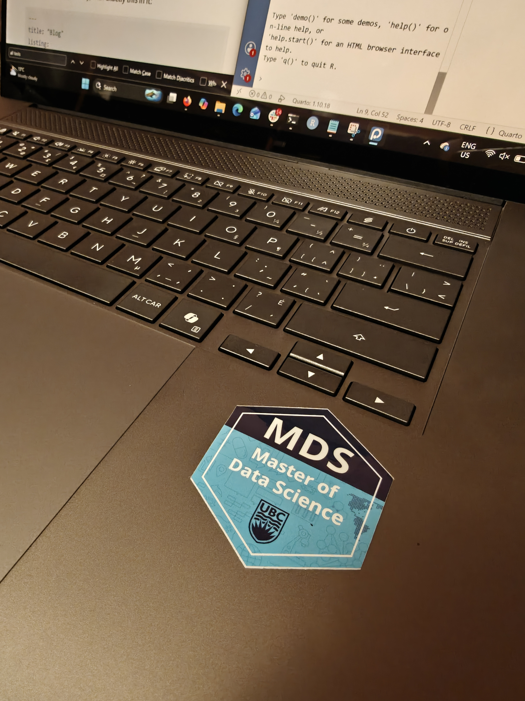

This program is a whirlwind. 

Without exageration, these past 2 weeks have already been the biggest academic challenge I've faced in entire my life. I'm commuting for 90 minutes to be on campus from 8:00am to 4:00pm and working all throughout on any of my 4 lab assignments due by the end of the week. And our exams are already around the corner. In week 3.

At the same time, I feel like I have finally found my people. All of us are data nerds speaking the same language and it's why we're here. It has me so excited for what's to come during the rest of this program.